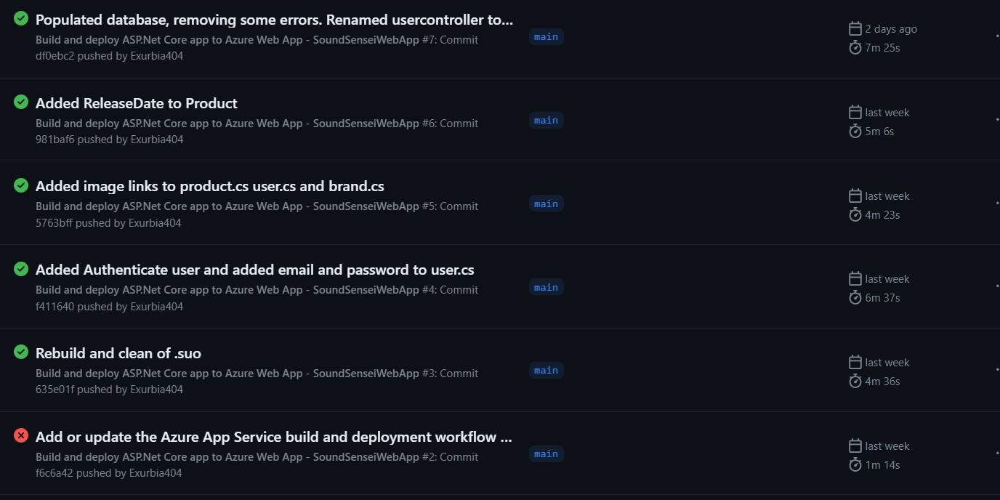

# Reader's guide

# Leeruitkomsten

### Web application

**Building a user-friendly full stack web application**

Op het moment ben ik bezig met het maken van SoundSensei, mijn web-based applicatie. Het zal een applicatie zijn waarop mensen audiophile equipment kunnen opzoeken en kunnen toevoegen aan hun want- of have lists. Ook moeten mensen documentatie kunnen toevoegen aan een product.

Ik heb een API geschreven in __ASP.NET 7__. De API maakt gebruik van een __Data - Models - Controller__ structuur. In mijn database bestaan (op 31-5) 3 tabellen; Users, Products en Brands. Hier komen uiteindelijk nog een wantlist en havelist bij. Ik gebruik __Microsoft Entity Framework__ om mijn data op te slaan en uit een database te halen.

De API staat momenteel online op <https://soundsenseiwebapp.azurewebsites.net/swagger/index.html> en wordt via Azure gehost. Ik heb ook een __MySQL database__ via Azure laten hosten waar mijn data in opgeslagen wordt. 

In mijn frontend maak ik gebruik van __React.js, Node.js en tailwind__. De frontend staat (op 31-5) nog niet online maar ook deze kan ik via Azure online zien te krijgen.

### Software quality

**You use software tooling and methodology that continuously monitors and improve the software quality during software development.**

 Tot slot kan ik allerlei testen schrijven om mijn software kwaliteit te checken.

### Agile method

**You can implement the software process for your project according to a given agile software development method.** 

Ik gebruik een Trello kanban bord om mijn project te managen. Een uitnodiging om deel te nemen aan de workspace is [Hier](https://trello.com/invite/b/0F2U4pv4/ATTI6facbb6aaba9b42c7fe6c076f33f3b2168DBE687/soundsensei "Trello invite") te vinden. Ik gebruik in het kanban bord labels om duidelijk aan te geven welk item bij welk onderdeel van mijn project hoort.

### CI/CD
**You implement a (semi)automated software release process that matches the needs of the project context.**

Ik heb op mijn backend CI/CD kunnen toepassen door middel van github actions and Azure CI/CD, hierdoor kan ik telkens als ik push naar mijn repo builden, testen en dan pas hosten.

### Cultural differences and ethics
**You recognize and take into account cultural differences when working with multi-site teams, and are aware of ethical aspects in software development.**

Zie Ethics.md and Cultural differences.md

### Requirements and design
**You translate (non-functional) requirements to extend existing (architectural) designs and can validate them using multiple types of test techniques.**

### Business processes
**You can explain simple business processes and relate them to the development of your software project.**

### Professional
**You act in a professional manner during software development and learning.**

